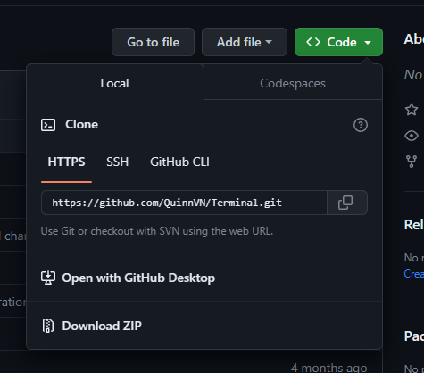
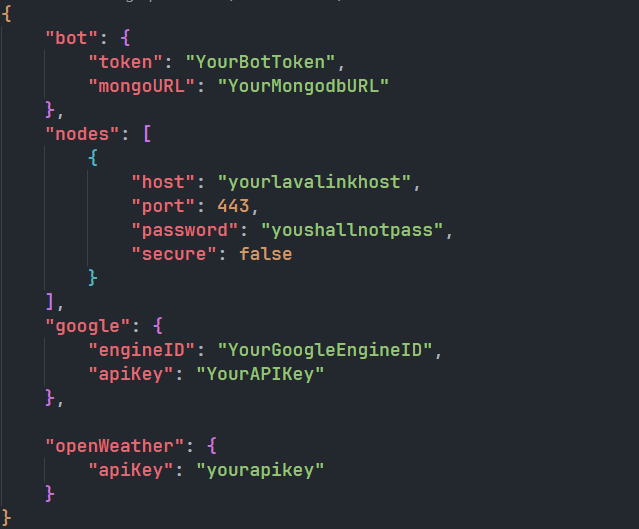
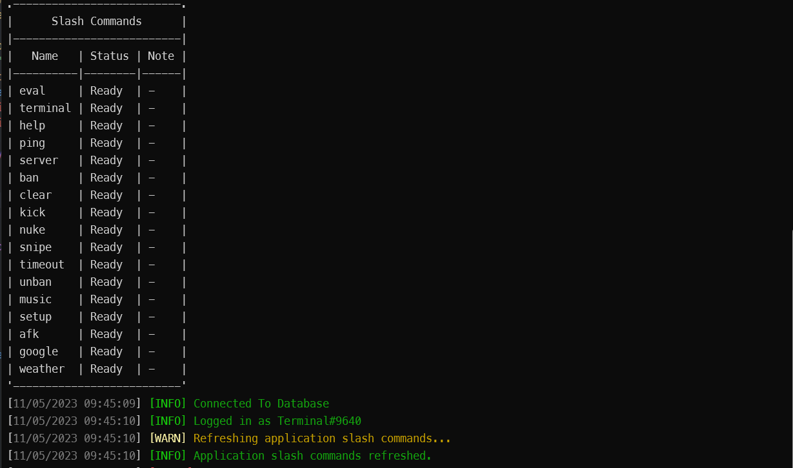

# Terminal

1 Con bot Dễ sử dụng, setup và làm quen

   

---

## How to run the bot locally

#### 1. Tải dự án về (việc này không dành cho người không am hiểu về setup bot)

Tải file zip của dự án về


Khi hoàn thành, mở CMD trong thư mục của bot và nhập lệnh:

```shell
npm run build
```

#### 2. Thiết lập bot

Mở file `config.json` và điền vào những mục cần thiết


#### 3.Bật bot

Kiểm tra lại xem tất cả những bước trên đã được hoàn tất hay chưa, nếu đã hoàn thành thì dùng lệnh:

```shell
npm run start
```

Nếu CMD hiện như thế này thì bot đã bật thành công


---

## Các Thiết lập của bot

Bạn có thể chỉnh sửa thiết lập của bot trong file `config.json`:

Bot:

-   <`token`>: Bot token
-   <`mongoURL`>: URL của MongoDB

Các máy chủ lavalink

-   `host`: Lavalink server hostname
-   `port`: Lavalink server port (Mặc định là _443_)
-   `password`: Lavalink server password
-   `secure`: Máy chủ lavalink có an toàn không (Mặc định là _`false`_)

Google:

-   `engineID`: Google custom search engine ID
-   `apiKey`: Google custom search engine API key

openWeather:

-   `apiKey`: OpenWeather API key

**Note:** _<>: required_

---

## Support

**END OF SUPPORT**
